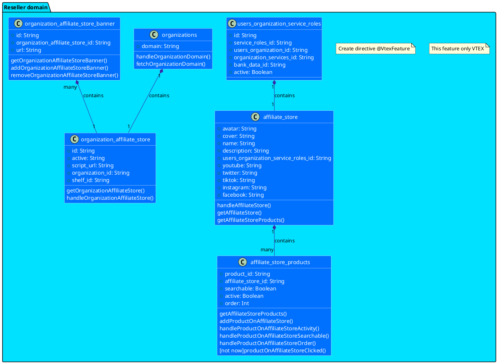

### Affiliate Inside Sales Architecture

###### Inside sales is a new sales channel, this feature based on vtex apis to get cart by sales affiliate.

```plantuml
@startuml
package "Reseller domain" #00E0FF {

    skinparam class {
        BackgroundColor #0070FF
        ArrowColor #3B24A8
        BorderColor White
        FontColor White
        AttributeFontColor White
        FontSize 16
        AttributeFontSize 14
        FontName Arial
    }
    skinparam stereotypeCBackgroundColor White

    note "This feature only VTEX" as N1

    note "Create directive @VtexFeature" as N2

    class users_organization_service_roles {
        + id: String
        + service_roles_id: String
        + users_organization_id: String
        + organization_services_id: String
        + bank_data_id: String
        + active: Boolean
    }

    class organizations {
        + domain: String
    }
    organizations : handleOrganizationDomain()
    organizations : fetchOrganizationDomain()

    class organization_affiliate_store {
        + id: String
        + active: String
        + script_url: String
        + organization_id: String
        + shelf_id: String
    }
    organization_affiliate_store : getOrganizationAffiliateStore()
    organization_affiliate_store : handleOrganizationAffiliateStore()

    class organization_affiliate_store_banner {
        + id: String
        + organization_affiliate_store_id: String
        + url: String
    }
    organization_affiliate_store_banner : getOrganizationAffiliateStoreBanner()
    organization_affiliate_store_banner : addOrganizationAffiliateStoreBanner()
    organization_affiliate_store_banner : removeOrganizationAffiliateStoreBanner()

    class affiliate_store {
        + avatar: String
        + cover: String
        + name: String
        + description: String
        + users_organization_service_roles_id: String
        + youtube: String
        + twitter: String
        + tiktok: String
        + instagram: String
        + facebook: String
    }
    affiliate_store : handleAffiliateStore()
    affiliate_store : getAffiliateStore()

    class affiliate_store_products {
        + product_id: String
        + affiliate_store_id: String
        + searchable: Boolean
        + active: Boolean
        + order: Int
    }
    affiliate_store_products : getAffiliateStoreProducts()
    affiliate_store_products : addProductOnAffiliateStore()
    affiliate_store_products : handleProductOnAffiliateStoreActivity()
    affiliate_store_products : handleProductOnAffiliateStoreSearchable()
    affiliate_store_products : handleProductOnAffiliateStoreOrder()
    affiliate_store : getAffiliateStoreProducts()
    affiliate_store_products : [not now]productOnAffiliateStoreClicked()

    users_organization_service_roles "1" *-- "1" affiliate_store : contains

    affiliate_store "1" *-- "many" affiliate_store_products : contains

    organizations "1" *-- "1" organization_affiliate_store : contains

    organization_affiliate_store_banner "many" *-- "1" organization_affiliate_store : contains

}
@enduml
```
