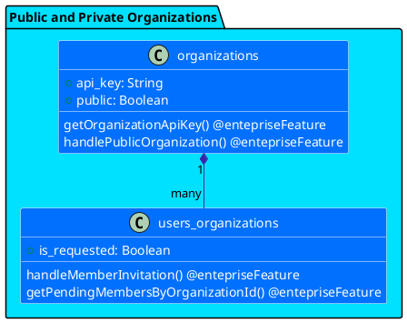

### Forms to invite members by rest API with public and private organizations

###### Enterprise Organizations can send a bulk invite by external form in plugone rest API, public and private organizations accept ou pending requests.

##### \* This feature only enteprise accounts

##### \* Create directive @entepriseFeature

##### \* Create directive @validUser -> so deixa passar o 'invite_status approved'

###### - Create rest api in https://api.plugone.io/invite-member/ :organizationName, send bearer with api Key to validate request. Limit in 1500 requests per org/day and 1 per minute.

###### - Receive request in rest api -> validate with bearer token -> verify if as enteprise account -> verify if as public or private organizations.

###### - if public organization pre signup member, sent email with more informations about with complete singup.

###### - if private organization pre signup member, sent email with more informations about with complete singup, create a list with pending status for org administrators approv and list a org only with approved status.
